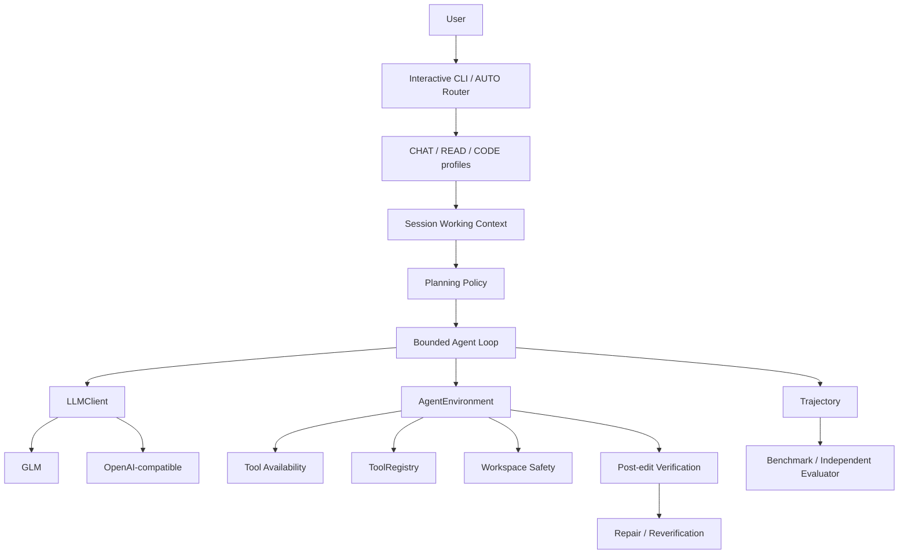

# Java Coding Agent

**Model-agnostic Java Coding Agent Runtime and Evaluation Harness.** This research/educational project explores how bounded tool execution, workspace context, planning, verification, and recovery affect coding-agent behavior; it is not a production IDE replacement.

## Why this project

An LLM tool call succeeding does not imply that the workspace is correct. A coding agent also needs a bounded execution loop, safe workspace access, useful cross-turn context, verification, recovery from typed failures, and evaluation that checks the workspace instead of trusting the model's final prose.

## Architecture



The runtime loop is:

```text
User task → model decision → tool call → typed ToolResult → workspace change
          → reread → verifier → PASS / FAIL / UNAVAILABLE
                              FAIL → RepairDirective → fresh read
                                   → bounded repair → reverify
```

Unavailable tools are hidden from model definitions and checked again before dispatch, so a stale call is rejected. The current production environment policy is deliberately narrow: it gates `run_maven_test` on a safe regular `pom.xml` at the workspace root.

## Key capabilities

- **Production/default CLI:** `AUTO` routing to `CHAT`, `READ`, or `CODE`; workspace-confined file tools; bounded structured session working context; `LLMClient` and `AgentEnvironment` abstractions; typed tool results; generic post-edit verification; guided repair; dynamic Maven-tool availability; trajectory logging.
- **Experimental:** opt-in `PLAN_EXECUTE` and `ADAPTIVE` planning policies, plus benchmark-only ablations. The CODE profile defaults to `REACTIVE`.
- **Main CODE tools:** `list_files`, `find_files`, `read_file`, `search_code`, `apply_patch`, `insert_before`, `insert_after`, `create_file`, and conditionally `run_maven_test`. `replace_lines` is experimental and not in the normal CLI profile.
- **Providers:** GLM is the default and supports streaming. The OpenAI-compatible chat-completions adapter supports tool calling but is currently non-streaming.

## Quick Start

Requirements: Java 17 and Maven 3.9+.

```powershell
git clone https://github.com/Perry-xwr/java-coding-agent.git
Set-Location java-coding-agent
mvn test
```

Configure the default GLM provider and start the CLI:

```powershell
$env:MODEL_PROVIDER = "glm"
$env:GLM_API_KEY = "YOUR_API_KEY"
# Optional proxy, only if your network requires it:
# $env:MODEL_PROXY = "http://127.0.0.1:7897"
mvn exec:java "-Dexec.mainClass=com.agent.Main"
```

The CLI starts in `AUTO`; `/chat`, `/read`, `/code`, and `/auto` select a profile explicitly. `mvn test` is deterministic and does not call a model provider. See [Demo](demo/README.md) for three offline walkthroughs and optional live usage notes.

## Reliability / Evaluation

The repository contains historical and paired DEV evaluations for working memory, planning, adaptive planning, edit verification, verification-guided repair, and environment-aware Maven-tool availability. These are small, stochastic experiments, not statistical studies. Results and limitations are summarized in [Evaluation](docs/EVALUATION.md); the chronological research narrative is in [Evolution](docs/EVOLUTION.md).

## Configuration

| Variable | Required | Default | Description |
|---|---|---|---|
| `MODEL_PROVIDER` | No | `glm` | `glm` or `openai-compatible`. |
| `GLM_API_KEY` | For GLM | None | GLM credential; never store it in the repository. |
| `MODEL_BASE_URL` | OpenAI-compatible | `https://open.bigmodel.cn/api/paas/v4` for GLM | Base URL; required for `openai-compatible`. |
| `MODEL_NAME` | OpenAI-compatible | `glm-4-flash` | Model name; required for `openai-compatible`. |
| `MODEL_API_KEY` | No | Unset | Optional key for OpenAI-compatible endpoints. |
| `MODEL_PROXY` | No | Direct connection | Optional HTTP proxy URL, e.g. `http://host:port`. |
| `PLANNING_MODE` | No | `reactive` | CODE planning: `reactive`, `plan-execute`, or `adaptive`; latter two are experimental. |
| `GLM_DEBUG` | No | `false` | Set `true` to print GLM HTTP status diagnostics. |

Example OpenAI-compatible configuration (endpoint and credentials are user supplied):

```powershell
$env:MODEL_PROVIDER = "openai-compatible"
$env:MODEL_BASE_URL = "https://your-compatible-endpoint/v1"
$env:MODEL_NAME = "your-model-name"
$env:MODEL_API_KEY = "YOUR_API_KEY" # optional for unauthenticated local endpoints
```

`MODEL_PROXY` is optional for either provider. The OpenAI-compatible backend is not currently streaming. Configuration and validation details are in [Design](docs/DESIGN.md).

## Project structure

```text
src/main/java/com/agent/
  agent/          bounded loop, memory, planning, recovery
  environment/    workspace binding, availability, verification
  llm/            provider interfaces and adapters
  tool/           safe workspace tools and process execution
benchmark/        frozen task protocols and fixtures
docs/             design, evaluation, evolution, and interview notes
demo/             small example workspaces and offline walkthroughs
scripts/          local project verification
```

## Design principles

- Keep model, Agent, environment, tool catalog, and evaluation responsibilities separate.
- Treat tool outcomes and verification evidence as structured data, not claims in model prose.
- Bound iterations and workspace authority; fail closed on unsafe paths and unavailable capabilities.
- Preserve negative and infrastructure-limited results, and describe small samples conservatively.

Read [Design](docs/DESIGN.md), [Evaluation](docs/EVALUATION.md), [Evolution](docs/EVOLUTION.md), [Demo](demo/README.md), or [Resume / Interview Notes](docs/RESUME.md) for detail.

## Known limitations

- Model quality strongly affects tool choice, editing, and recovery; structurally sensitive edits can still select a poor tool or anchor.
- Verification is syntax/build oriented, not proof of semantic correctness. `UNAVAILABLE` is distinct from `PASS`.
- The small V1.9 DEV study did not show a stable recovery advantage; repair remains limited.
- Environment-aware tool filtering currently covers only Maven-tool availability based on a safe root POM.
- C/C++ verification requires local `gcc`/`g++`; verifier availability varies by machine.
- There is no transactional rollback after an unsuccessful edit or final verification failure.
- Several live evaluations use one provider/model; benchmark sets are small and descriptive, not statistically significant.
- Planning and adaptive routing are experimental. The runtime is not an IDE replacement.

## Development / tests

Run all deterministic tests with:

```powershell
mvn test
```

For a local environment check plus the same test suite:

```powershell
./scripts/verify-project.ps1
```

The script does not install dependencies, configure the machine, or call a provider. Optional live model use is user-initiated and requires provider configuration above.
